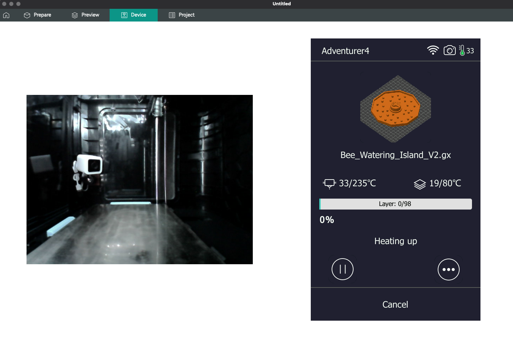

# FlashForge-Hacks
This project contains a set of scripts trying to provide additional features and functionality not implemented by the official firmware.  It is an experimental research project and should be treated as such.

1. Adds `dropbear` SSH service to your printer
2. Adds `httpd` WEB service to your printer.
3. Updates the `root` password to `flashforge`

# ATTENTION (PROCEED AT YOUR OWN RISK)
While this installer package will add a SSH and HTTPD Services to your printer and modifies the root password to `flashforge` it does this by modifying the `auto_run.sh` script file which is used by the printer to manages updates and execute your printer's official software.

There is ALWAYS a POSSIBILITY that an error could occur during installation and thus I am not responsible nor am I liable for rendering your printer useless.  While we do have some safeguards in place to prevent errors from happening during installation, PROCEED AT YOUR OWN RISK!

Lastly, since the Adventurer 4 runs busybox, this also means your are running with ROOT PRIVILEGES and have the ability to BRICK your printer again am I not responsible nor am I liable for any damages that YOU may incur by using this software!

# Target (Adventurer 4)
I have only tested against the Adventurer4-2.2.4-2.3-20230216 and the files used by this installer are based on the contents of the official firmware.  I have heavily modified the `flashforge_init.sh` script in order to install both the SSH and HTTPD services and reused their `play` application to generate the upgrade completion tones.  The original official firmware files used can be found within the `Firmware` directory.

# Installation
* Copy all contents from the `Installer` directory and place them in the root of the USB flash disk.
* Power OFF printer and insert USB flash disk.
* Power ON printer
  * Printer will display upgrade in progress.
  * Wait until display shows upgrade completed and plays a melody.
* Power OFF printer and remove USB flash disk.
* Power ON printer
  * Use your favorite SSH client to access the filesystem remotely!
  * Use your favorite Browser to view your printer's camera and UI!
  * Use OrcaSlicer's Device tab to view your prints in real-time!

# Debugging Installation
* If for some reason the update does not take effect, then execute the following steps and report back!
  * Copy `flashforge_init.sh.debug` to the root of the USB stick.
  * Rename `flashforge_init.sh.debug` -> `flashforge_init.sh` on the USB stick.
  * Follow the steps outlined above within the `Installation` process.
  * Report back with the `log.txt` stored on the root of the USB stick.

# Subscribe
If you enjoyed this work and would like to stay up to date on any future findings please feel free to join my patreon.

